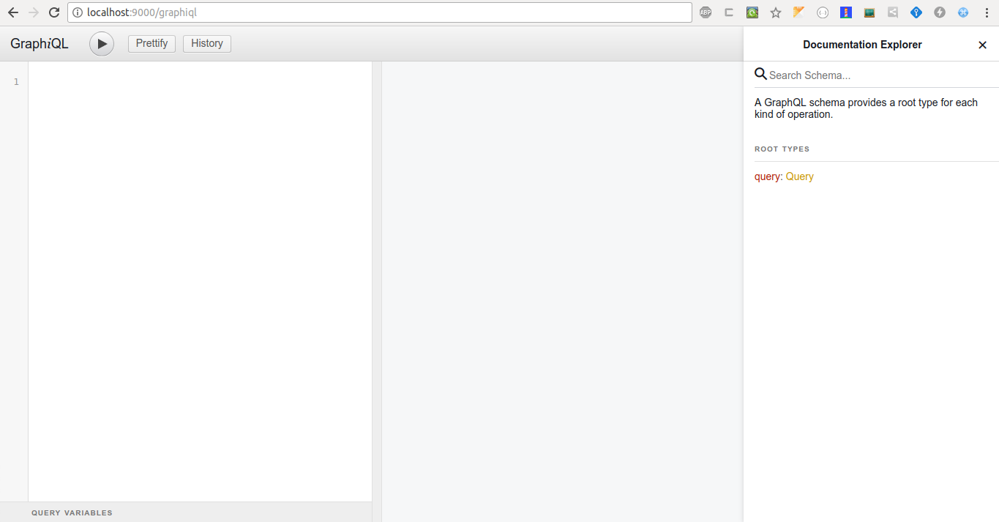

# zditm-graphql
<<<<<<< HEAD

## Description

GraphQL Proxy for Zditm API

## Installation

```bash
yarn install
# or
npm install
```

## Start

```bash
yarn start
# or
npm run start
```

Open url: http://localhost:9000/graphiql



## Environments

Environments are located in file `.env`.

## Links

- https://github.com/nestjs/nest
- https://github.com/apollographql/apollo-server

## License

Zditm-graphql is [MIT licensed](LICENSE).
=======
GraphQL Proxy for Zditm API
>>>>>>> 1b37fb8f51dd6c012de83b9b3bb6628b334cd25b
