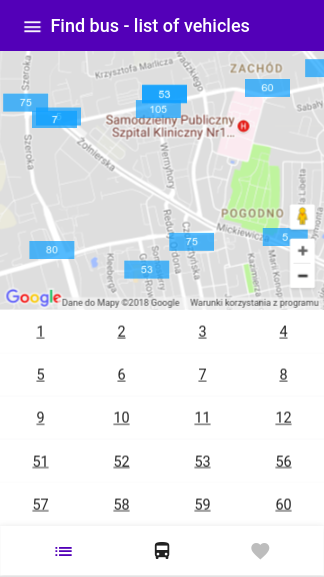
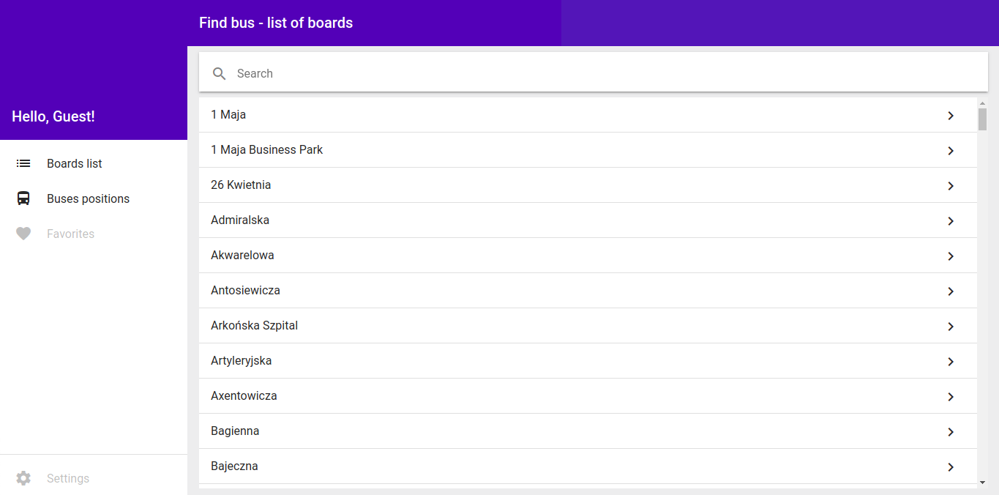
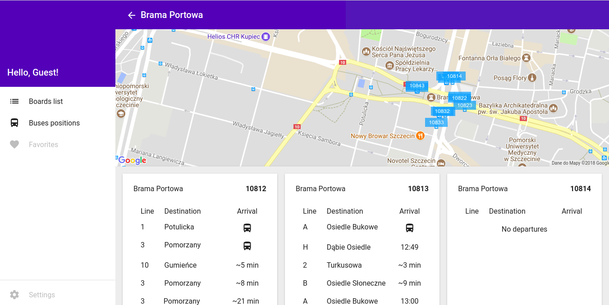

# Find Bus

## Description

GraphQL Proxy for [Zditm API](https://www.zditm.szczecin.pl/) with Angular 5 PWA.

It bases on data from ZDITM and shows position of buses which have GPS.
Important! Some older buses haven't buildin GPS, so app won't show their positions.

[Online version](https://findbus.webjs.eu)

## Screenshoots

### Mobile

### Desktop

## Development

TODO

## Links

- [Nest.js](https://github.com/nestjs/nest)
- [Apollo Server](https://github.com/apollographql/apollo-server)
- [Angular](https://angular.io/)
- [Apollo Client](https://github.com/apollographql/apollo-client)

## License

Find bus is [MIT licensed](LICENSE).